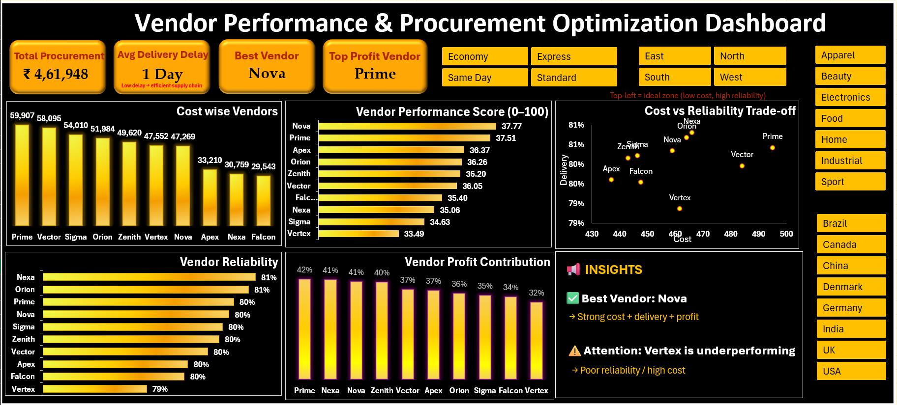

# 📊 Vendor Performance & Procurement Optimization Dashboard

An interactive **Microsoft Excel** dashboard designed to evaluate vendor performance and optimize procurement decisions using key business metrics such as procurement cost, delivery reliability, profit contribution, and a custom vendor performance score.

## 📌 Project Overview

Vendor selection plays a critical role in procurement and supply chain management. This project provides a data-driven approach to evaluating vendors by analyzing multiple performance indicators instead of relying solely on procurement cost.

The dashboard enables users to compare vendors, identify top-performing suppliers, monitor procurement KPIs, and make informed sourcing decisions through interactive visualizations and dynamic insights.

---

## 🚀 Features

- 📈 Interactive KPI Dashboard
- 📊 Vendor Performance Score (0–100)
- 💰 Cost-wise Vendor Analysis
- 📦 Vendor Profit Contribution Analysis
- 🚚 Vendor Reliability Analysis
- ⚖️ Cost vs Reliability Trade-off Analysis
- 🎯 Dynamic Insights Section
- 🔍 Interactive Slicers (Region, Country, Category, Shipping Mode)
- 🧹 Data Cleaning using Power Query
- 📋 Pivot Table & Pivot Chart Analysis
- 📌 Procurement Decision Support

---

## 🛠️ Tools & Technologies

- Microsoft Excel
- Power Query
- Pivot Tables
- Pivot Charts
- Excel Formulas
- Interactive Slicers
- Data Visualization

---

## 📈 Dashboard KPIs

- Total Procurement Spend
- Average Delivery Delay
- Best Performing Vendor
- Highest Profit Vendor

---

## 💡 Business Insights

- Identifies the best-performing vendor using a composite performance score.
- Highlights underperforming vendors requiring attention.
- Analyzes procurement cost and delivery reliability simultaneously.
- Supports data-driven procurement and vendor selection decisions.

---

## 📷 Dashboard Preview




---

## 📂 Repository Structure

```
vendor-performance-procurement-dashboard
│
├── Dashboard.xlsx
├── README.md
├── images/
│   └── dashboard.png
│   └── pivots.png
│   └── dynamic insight.png
│   └── dynamic insight formula.png
├── report.docx
├── problem_statement.docx

```

---

## 🎯 Skills Demonstrated

- Data Cleaning
- Data Transformation
- Procurement Analytics
- Dashboard Design
- KPI Development
- Data Visualization
- Business Analysis
- Power Query
- Pivot Table Analysis

---

## 👨‍💻 Author

**Sarvesvaran G**

Aspiring Data Analyst passionate about transforming raw data into actionable business insights using Excel, SQL, Power BI, Python, and Tableau.

**LinkedIn:** *https://www.linkedin.com/in/gsarvesvaran/*  
**GitHub:** *https://github.com/gsarvesvaran*

---

⭐ If you found this project interesting, consider giving it a star!
